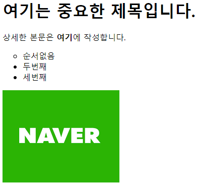
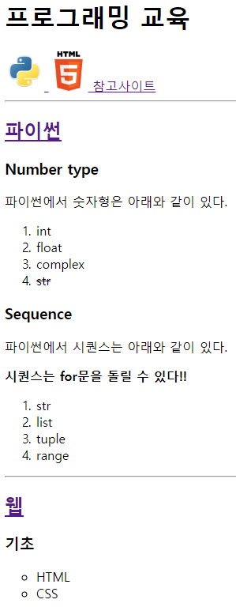
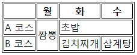
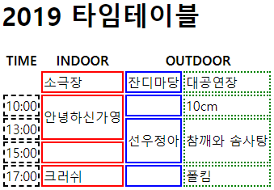
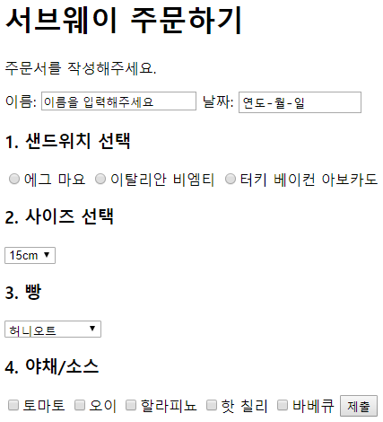

# Web Service 1주차 (2019.07.29)

## World Wide Web

> 세계적인 정보공간으로, 우리는 웹 서비스를 만드는 것이 목표다.
>
> 

클라이언트는 서버에 요청을 보내며, 서버는 클라이언트에게 응답을 보낸다.

웹서비스의 서버는 고객의 요청에 대한 예상과 응답을 해준다.


우리는 Flask, Django를 배울 예정이다. 그리고 개발자 친화적인 브라우저인 크롬을 사용할 것이다.

서버컴퓨터에서 요청과 응답을 처리할 프로그램을 만들 것이다.


## 요청의 종류

### Get 요청

return을 'ok'나 문서로 받는다.


### Post 요청

return을 'ok'로 받는다.


## Static Web

정말 단순한 웹 서비스로 클라이언트가 요청을 보내면 서버가 응답한다.


고객이 요청을 보내는 프로그램? 크롬(Chrome)

html문서를 읽고 그대로 보여준다.


`/User/이름/Desktop/test.html` `(file://)/User/이름/Desktop/test.pdf`을 크롬 주소창에 입력하면 (보기좋게) 바꿔준다.

위처럼 원하는 경로만 잘 입력한다면 읽을 수 있다. 인터넷으로 접속하는 것에 도움이 된다.


`172.217.27.78` 를 주소창에 검색해보면 구글 홈페이지가 뜨는 것을 확인할 수 있다. 하지만 접근하기 불편하다.

이는 `google.com`처럼 고유명사로 표현하면 접근하기 편하다.


### IP(인터넷 프로토콜)

8비트 4덩어리로 되어있는 고유한 IP값이였으나, 현재 주소가 꽉 차서 16비트로 바뀌어가는 중이다.


### Domain(도메인)

네트워크 상의 컴퓨터를 식별하는 호스트명이다.


### URL(리소스 로케이터)

자료를 찾기위한 주소로, 경로에 접근하는데 사용된다.


## Dynamic Web

`http(s)://hphk/lectures/1`처럼 작성한다. 규격을 만들고 링크만 바꾼다.


w3c는 웹 표준으로 css, html, js가 있다.


### HTML (Hyper Text Markup Language)

> 뼈대를 만들어주는 역할을 한다.
>
> 

HTML: Hyper Text를 주고받는 규칙을 말한다.

HTTP: Hyper Text Transfer Protocol

Markup: 단순 text에 의미를 부여해준 것

Language: 웹페이지를 작성하기 위한 역할표시 언어

HTML 파일: HTML로 작성된 문서파일


### CSS

> html로 작성한 페이지를 예쁜 페이지로 만들어준다.

위치이동, 색깔이동, 모양이동이 가능하다.


## HTML 문서의 기본 구조

Doctype: 사용하는 문서의 종류를 선언하는 부분으로 주로 html을 사용한다.

html: html문서의 최상위 요소로 head와 body 부분으로 구분된다. 경로가 담겨있다.


## Tag와 DOM TREE

### 요소

HTML의 element는 태그와 내용(contents)로 구성되어 있다.

`<hl>`여는 태그와 `</h1>`닫는 태그로 구성되어 있다.

태그는 대소문자를 구별하지 않으나 소문자로 작성해야 하며, 닫는 태그가 없는 경우도 존재한다.


### 속성

속성과 속성명을 태그 안에 적을 수 있다.

`<a>`는 hyper text를 연결해준다.`<a href="google.com"/>`

id, class, style 태그 상관없이 모두 사용 가능하다.


### DOM트리

```html
<body>
    <h1>웹문서</h1>
    <ul>
        <li>HTML</li>
        <li>CSS</li>
    </ul>
</body>
```

body태그와 h1태그는 부모-자식관계이고, h1 태그와 ul (순서없는 리스트)태그는 형제관계이다.


### 시맨틱 태그

개발자의 의도가 잘 보이는 태그로, 이전에는 division만 가져왔다.

SEO(검색 엔진 최적화): 검색엔진에서 분석하기 좋게 만들어준다.

ex) 멀티캠퍼스 vs 패스트캠퍼스 구글에 검색해보자.


#### 시맨틱 태그 확인방법

1. 구글 확장프로그램 Web Developer를 설치해준다.

2. 주소창 옆의 톱니바퀴모양을 클릭하고, information > View Document Outline을 클릭해준다.
3. 페이지의 `<h1>` `<h2>`등을 확인할 수 있다.

네이버 뉴스와 구글 뉴스의 시맨틱 태그를 확인해보면 구글 뉴스가 잘 정리해 놓았다는 것을 알 수 있다. 구글 뉴스능 `<h>`별로 정리해 놓았기 때문에 기사 제목만 뽑기 쉽다.


모든 페이지에서 `<h1>`은 하나만 쓰는 것이 원칙이다. `<h1>`을 크기변경시에 사용하지는 않는다. 글자의 크기를 조정하고 싶은 경우 css파일을 이용하는 것이 좋다.


`<b></b>`는 굵은 글씨로 만들어주고, `<strong></strong>`은 시맨틱 태그다.


### 예시



```html
<!-- 여기는 주석입니다. -->
<h1>여기는 중요한 제목입니다.</h1>
<P>상세한 본문은 <b>여기</b>에 작성합니다.</P>

<ul>
    <li style="list-style: circle">순서없음</li>
    <li>두번째</li>
    <li>세번째</li>
</ul>

<a href="https://naver.com">
    
</a>
```


## Django

### Wappalyzer

구글 확장프로그램을 설치하였다. 이를 활용하면 페이지의 공개되어있는 언어, 개발환경 등을 확인할 수 있다. Django같은 경우 서버를 신속하게 만들기 좋다.

최근 하나의 서버로 웹, 모바일 다 연동된다.


### StackShare

위와 마찬가지로 언어, 개발환경 등을 알 수 있는 사이트다.

https://stackshare.io/


## 실습1



```html
<body>
    <h1>프로그래밍 교육</h1>
    <a href="#python">
        
    </a>
    <a href="#web">
        
    </a>
    <a href="intro.html">참고사이트</a>
    <hr>
    <h2 id="python"><a href="https://docs.python.org/ko/3/tutorial/index.html" target="_blank">파이썬</a></h2>
    <h3>Number type</h3>
    <p>파이썬에서 숫자형은 아래와 같이 있다.</p>
    <ol>
        <li>int</li>
        <li>float</li>
        <li>complex</li>
        <li><del>str</del></li>
    </ol>
    <h3>Sequence</h3>
    <p>파이썬에서 시퀀스는 아래와 같이 있다.</p>
    <p><b>시퀀스는 for문을 돌릴 수 있다!!</b></p>
    <ol>
        <li>str</li>
        <li>list</li>
        <li>tuple</li>
        <li>range</li>
    </ol>
    <hr>
    <h2 id="web"><a href="https://developer.mozilla.org/ko/">웹</a></h2>
    <h3>기초</h3>
    <ul>
        <li style="list-style: circle">HTML</li>
        <li style="list-style: circle">CSS</li>
    </ul>
```

여는태그, 닫는태그를 미리 적어두는 편이 좋다.

`<hr>`은 되도록 작성하지 않은 편이 좋다.

`<h4>`와 `<p>`의미하는 바가 다르기 때문에 구분하는 것이 좋다.

`<h>`는 제목을 의미하고, `<p>`는 본문을 의미한다.

하이퍼링크를 걸거나 이미지를 가져올 때, 주소 설정은 현재 폴더 기준이다.

`width`와 `height`는 이미지의 크기를 조정할 수 있다.


### 참고 사이트

https://www.w3schools.com/tags/default.asp

html의 태그 정보를 확인할 수 있다.


## 실습2

```html
<iframe width="560" height="315" src="https://www.youtube.com/embed/sD0NjbwqlYw" frameborder="0" allow="accelerometer; autoplay; encrypted-media; gyroscope; picture-in-picture" allowfullscreen></iframe>
```

YouTube 동영상 안에 있는 공유버튼의 퍼가기를 누르면 `<iframe>`이 나오는데, 그것을 html에 복사하면 영상이 나온다. 하지만 이 방법은 추천하지 않는다.

`<iframe>`은 html내부에 다른 html을 넣을 때 사용한다.


## 실습3



````html
<table style="border: 1px solid">
    <thead>
        <th style="border: 1px solid"></th>
        <th style="border: 1px solid">월</th>
        <th style="border: 1px solid">화</th>
        <th style="border: 1px solid">수</th>
    </thead>
    <tbody>
        <tr>
            <td style="border: 1px solid">A 코스</td>
            <td rowspan="2" style="border: 1px solid">짬뽕</td>
            <td colspan="2" style="border: 1px solid">초밥</td>
        </tr>
        <tr>
            <td style="border: 1px solid">B 코스</td>
            <td style="border: 1px solid">김치찌개</td>
            <td style="border: 1px solid">삼계탕</td>
        </tr>
    </tbody>
</table>
````

`style="border: 1px solid"`는 표의 테두리를 만드는것에 사용된다.

`rowspan`은 열을 병합해주고, `colspan`은 행을 병합해준다. 병합하면서 사라진 열과 행을 코드에서 지워줘야 원하는 표 모양을 얻을 수 있다.


## 실습4



```html
<table>
    <thead>
        <h1>2019 타임테이블</h1>
        <th>TIME</th>
        <th>INDOOR</th>
        <th colspan="2">OUTDOOR</th>
    </thead>
    <tbody>
        <tr>
            <td></td>
            <td style="border: 2px solid red">소극장</td>
            <td style="border: 2px solid blue">잔디마당</td>
            <td style="border: 2px dotted green">대공연장</td>
        </tr>
        <tr>
            <td style="border: 2px dashed black">10:00</td>
            <td rowspan="2" style="border: 2px solid red">안녕하신가영</td>
            <td style="border: 2px solid blue"></td>
            <td style="border: 2px dotted green">10cm</td>
        </tr>
        <tr>
            <td style="border: 2px dashed black">13:00</td>
            <td rowspan="2" style="border: 2px solid blue">선우정아</td>
            <td rowspan="2" style="border: 2px dotted green">참깨와 솜사탕</td>
        </tr>
        <tr>
            <td style="border: 2px dashed black">15:00</td>
            <td style="border: 2px solid red"></td>
        </tr>
        <tr>
            <td style="border: 2px dashed black">17:00</td>
            <td style="border: 2px solid red">크러쉬</td>
            <td style="border: 2px solid blue"></td>
            <td style="border: 2px dotted green">폴킴</td>
        </tr>
    </tbody>
</table>
```


### form 태그 (07.30 풀이 예정)

> 새로운 양식을 만든다.

`<form>`은 하나의 양식을 만들기 때문에, 여러개의 항목이더라도 같은 `<form>`안에 작성해주는 편이 좋다.




```html
<body>
    <h1>서브웨이 주문하기</h1>
    <p>주문서를 작성해주세요.</p>

    <form action="">
        <label for="name">이름:</label>
        <input id="name" type="text" name="name" value="이름을 입력해주세요">

        <label for="when">날짜:</label>
        <input id="when" type="date" name="when">

        <h3>1. 샌드위치 선택</h3>
        <!-- <label for="">메인메뉴</label> -->
        <!-- radio에서 라벨은 좋지 않은 선택 -->
        <input id="option1" type="radio" name="main" value="1"><label for="option1">에그 마요</label>
        <input id="option2" type="radio" name="main" value="2"><label for="option2">이탈리안 비엠티</label>
        <input id="option3" type="radio" name="main" value="3"><label for="option3">터키 베이컨 아보카도</label>

        <h3>2. 사이즈 선택</h3>
        <select name="" id="">
            <option value="">15cm</option>
            <option value="">30cm</option>
        </select>

        <h3>3. 빵</h3>
        <select name="" id="">
            <option value="">허니오트</option>
            <option value="" disabled="">플랫브래드</option>
            <option value="">하티 이탈리안</option>
        </select>

        <h3>4. 야채/소스</h3>
        <input id="option4" type="checkbox" name="main" value="4"><label for="option4">토마토</label>
        <input id="option5" type="checkbox" name="main" value="5"><label for="option5">오이</label>
        <input id="option6" type="checkbox" name="main" value="6"><label for="option6">할라피뇨</label>
        <input id="option7" type="checkbox" name="main" value="7"><label for="option7">핫 칠리</label>
        <input id="option8" type="checkbox" name="main" value="8"><label for="option8">바베큐</label>

        <input type="submit">
    </form>
</body>
```

`type="radio"`는 여러항목 중 하나를 선택해주는 타입이다. `name="main"`은 여러개의 `radio`중에 하나만 선택할 수 있도록 해주는 명령어다. `<input id="option1>"`과 `<label for="option1">에그 마요</label>`는 '에그 마요'를 선택하더라도 체크가 되도록 라벨링해주는 명령어다.

`type="checkbox"`는 여러 항목 중 여러개를 선택할 수 있게 해준다.

`<select>`와 `<option>`은 주어진 항목 중에서 선택할 수 있도록 해준다. 옵션에서 `<option disabled="">`를 적어주게 되면 `disabled`가 적힌 항목은 선택할 수 없도록 표시된다.