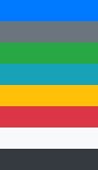

# Web Service 1주차 (2019.07.31)

## Selector


```css
'*'은 '모든 엘리먼트'를 뜻한다.
* {
    color: red;
}

/* 태그 셀렉터 */
h1 {
    color: red;
}

/* 그룹 */
h1, h2 {
    background-color: gray;
}

/* 클래스 */
.class-selector {
    color: blue;
}

/* 아이디 */
#id-selector {
    color: green;
}
```

```html
<head>
    <link rel="stylesheet" href="06_selector.css">
</head>
<body>
    <h1>셀렉터</h1>
    <h2>태그</h2>
    <h2 class="class-selector">클래스</h2>
    <h2 id="id-selector">아이디</h2>
</body>
```


### 우선순위


```css
/* 
셀렉터들은 우선순위가 있다.
id > class > tag
*/
```

```html
<h1 class="class-selector">셀렉터</h1>
<h2>태그</h2>
<h2 class="class-selector" id="id-selector">클래스</h2>
<h2 id="id-selector">아이디</h2>
```


### important

> 다른 important는 충돌될 수 있으므로 잘 쓰지 않는다.


```css
h1 {
    color: red !important;
    background-color: black;
}

#id-selector {
    color: green;
    background-color: blue;
}
```

!important가 적혀있는 것만 우선순위 적용


### 자식 셀렉터


```css
/* 자식 셀렉터 */
/* ul태그의 자식인 li만 변경해준다. */
ul > li {
    color: pink;
}
```

```html
<ul>
    <li>position</li>
    <li>visibility</li>
    <li>display</li>
</ul>
```


### 형제 셀렉터

````html
<ol>
    <p>우리가 배운것</p>
    <li>position</li>
    <li>visibility</li>
    <li>display</li>
</ol>
````


```css
/* 바로 뒤에 인접한 형제. */
p + li {
    color: green;
}
```


```css
/* 그 뒤로 쭉 형제 */
p ~ li {
    color: blue;
}
```


## Bootstrap

'getbootstrap.com'사이트에서 get started를 누른 후 CSS를 복사해 `<head>`에 넣고, JS를 복사해 `<body>`에 넣는다. `<script>`는 무겁기 때문에 `<body>` 뒤쪽에 작성한다.


CDN 활용을 통해 Bootstrap에 작성된 CSS, JS를 활용해본다.

'getbootstrap.com' 사이트를 많이 활용하자

````html
<head>
    CSS 복사
</head>
<body>
    <h1>이제부터 부트스트랩</h1>
    JS 복사
````

위의 코드를 항상 붙여줘야 한다.


'getbootstrap.com'에서 Documentation - Components를 활용 예정이다.


### 1. Spacing

```
m: margin
p: padding
```

```
t: top
b: bottom
l: left
r: right
x: left, right
y: top, bottom
```

```
0:  0px 	n0:   0px
1:  4px 	n1:  -4px
2:  8px 	n2:  -8px
3: 16px 	n3: -16px
4: 24px 	n4: -24px
5: 48px 	n5: -48px
```

```html
class="mx-auto d-inline"
class="my-3"
```


### 2. Color



```
primary
secondary
success
info
warning
danger
light
dark
```


```html
class="bg-success alert-success"
```


### 3. Border


```html
class="border border-danger rounded-pill"
```


### 4. Display


```html
class="d-block"
class="d-sm-none"
class="btn btn-danger"
```


### 5. Fixed


```html
class="fixed-top"
```


### 6. Text


```html
class="text-center"
class="font-italic"
```


### intro.html


```html
<div class="container">
    <h1 class="mx-auto d-inline" style="width: 50%">이제부터 부트스트랩</h1>
    <h1 class="mx-auto d-none" style="width: 50%">이제부터 부트스트랩</h1>
    <h1 class="mx-auto bg-success alert-success">테스트</h1>
    <h1 class="d-sm-none">테스트</h1>
    <a href="https://www.naver.com" class="d-block btn btn-danger">네이버</a>
    <a href="https://www.naver.com" class="btn btn-danger fixed-top">네이버</a>
    <div class="my-3 border border-danger rounded-pill"><h1>구글</h1></div>
    <div class="my-3 text-center"><h1 class="font-italic">구글</h1></div>
</div>
```


## Grid System

> 12개의 칸으로 나눠서 구분한다.

12개의 칸으로 나눈 이유는 3등분, 4등분 하기 편하고, 양쪽을 날리면 5등분하기도 편하기 때문이다.


```html
<div class="container">
    <div class="row">
        <!-- 화면의 크기에 따라 화면을 다르게 보일 수 있다. -->
        <div class="col-2 col-sm-6 col-md-2 col-lg-6 col-xl-2 bg-danger">
            여기는 여섯칸
        </div>
    </div>
    <div class="row">
        <div class="col-6 bg-info">
            여기는 여섯칸
        </div>
    </div>
</div>
```


## Component

### navbar


````html
<!-- 메뉴 선택하는 바를 만들어준다. -->
<nav class="navbar navbar-expand-lg navbar-light bg-light">
    <a class="navbar-brand" href="01_grid.html">Instagram</a>
    <button class="navbar-toggler" type="button" data-toggle="collapse" data-target="#navbarNav" aria-controls="navbarNav" aria-expanded="false" aria-label="Toggle navigation">
        <span class="navbar-toggler-icon"></span>
    </button>
    <div class="collapse navbar-collapse" id="navbarNav">
        <ul class="navbar-nav">
            <li class="nav-item active">
                <a class="nav-link" href="#">Home <span class="sr-only">(current)</span></a>
            </li>
            <li class="nav-item">
                <a class="nav-link" href="#">Features</a>
            </li>
            <li class="nav-item">
                <a class="nav-link" href="#">Pricing</a>
            </li>
            <li class="nav-item">
                <a class="nav-link" href="#" tabindex="-1" aria-disabled="true">Disabled</a>
            </li>
        </ul>
    </div>
</nav>
````


### container

container 클래스 안에 `<di>`를 생성해준다.

```html
<!-- container를 class로 만들어준다. container안에 생성해준다. -->
<div class="container">
    <div class="jumbotron">
        내용
    </div>
    <div class="row">
        내용
    </div>
    <div id="carouselExampleControls" class="carousel slide" data-ride="carousel">
        내용
    </div>
</div>    
```


#### jumbotron


```html
<!-- jumbotron을 복사해준다. -->
<div class="jumbotron">
    <h1 class="display-4">Hello, world!</h1>
    <p class="lead">This is a simple hero unit, a simple jumbotron-style component for calling extra attention to featured content or information.</p>
    <hr class="my-4">
    <p>It uses utility classes for typography and spacing to space content out within the larger container.</p>
    <a class="btn btn-primary btn-lg" href="#" role="button">Learn more</a>
</div>
<button type="button" class="btn btn-primary">Primary</button>
<button type="button" class="btn btn-secondary">Secondary</button>
<a class="btn btn-outline-danger" href="https://google.com">구글</a>
```


#### card


```html
<!-- row는 card를 옆으로 나열해준다. -->
<div class="row">
    <div class="card mx-4" style="width: 18rem;">
        
        <div class="card-body">
            <h5 class="card-title">Card title</h5>
            <p class="card-text">Some quick example text to build on the card title and make up the bulk of the card's content.</p>
            <a href="#" class="btn btn-primary">Go somewhere</a>
        </div>
    </div>
    <div class="card mx-4" style="width: 18rem;">
        
        <div class="card-body">
            <h5 class="card-title">Card title</h5>
            <p class="card-text">Some quick example text to build on the card title and make up the bulk of the card's content.</p>
            <a href="#" class="btn btn-primary">Go somewhere</a>
        </div>
    </div>
    <div class="card mx-4" style="width: 18rem;">
        
        <div class="card-body">
            <h5 class="card-title">Card title</h5>
            <p class="card-text">Some quick example text to build on the card title and make up the bulk of the card's content.</p>
            <a href="#" class="btn btn-primary">Go somewhere</a>
        </div>
    </div>
</div>
```


#### carousel

```html
<!-- carousel의 정보를 붙여넣는다. -->
<div id="carouselExampleControls" class="carousel slide" data-ride="carousel">
    <div class="carousel-inner">
        <div class="carousel-item active">
            
        </div>
        <div class="carousel-item">
            
        </div>
        <div class="carousel-item">
            
        </div>
    </div>
    <a class="carousel-control-prev" href="#carouselExampleControls" role="button" data-slide="prev">
        <span class="carousel-control-prev-icon" aria-hidden="true"></span>
        <span class="sr-only">Previous</span>
    </a>
    <a class="carousel-control-next" href="#carouselExampleControls" role="button" data-slide="next">
        <span class="carousel-control-next-icon" aria-hidden="true"></span>
        <span class="sr-only">Next</span>
    </a>
</div>
```

'https://getbootstrap.com/docs/4.3/components/alerts/'를 참고한다.


## Flask

### app.py

```python
from flask import Flask, escape, request

app = Flask(__name__)

@app.route('/')
def hello():
    return render_template('index.html')

# app.py를 오류가 발생하지 않으면 계속 실행하도록 해준다.
if __name__ == "__main__":
    app.run(debug=True)
```

flask를 실행해준다. 


### base.html

bootstrap을 계속해서 html에 적어주는 것은 비효율적이므로 base.html을 만들어줬다.

```html
<head>
    CSS 복사
</head>
<body>
    <nav class="navbar navbar-expand-lg navbar-light bg-light">
        navbar
    </nav>
    <div class="container">
        
        
    </div>
    JS복사
</body>
```

이를 다른 html에서는 아래처럼 불러올 수 있다.


#### index.html

```html



  <h1>여기는 저의 사이트입니다.</h1>

```

추가적인 내용은 'block body'와 'endblock' 사이에 작성하면 된다.


### lotto

#### app.py

````python
@app.route('/lotto')
def lotto():
    numbers = random.sample(range(1, 46), 6)
    print(numbers)
    return render_template('lotto.html', numbers=numbers)
````


#### .html

```html



  {{numbers}}

```


### lunch

#### app.py

```python
@app.route('/lunch')
def lunch():
    menus = ['짜장면', '짬뽕', '파스타', '나주곰탕']
    pick = random.choice(menus)
    return render_template('lunch.html', pick=pick)
```


#### .html

```html



  <h1>{{pick}}</h1>

```


### opgg

#### app.py

```python
@app.route('/opgg')
def opgg():
    return render_template('opgg.html')

@app.route('/search')
def search():
    opgg_url = 'https://www.op.gg/summoner/userName='
    summoner = request.args.get('summoner')
    url = opgg_url + summoner
    
    res = requests.get(url).text
    
    soup = BeautifulSoup(res, 'html.parser')
    tier = soup.select_one('#SummonerLayoutContent > div.tabItem.Content.SummonerLayoutContent.summonerLayout-summary > div.SideContent > div.TierBox.Box > div > div.TierRankInfo > div.TierRank')
    user_tier = tier.text.strip()

    return render_template('search.html', user_tier=user_tier, summoner=summoner)
```


#### opgg.html

```html



<form action="/search">
  <div class="form-group">
    <label for="summoner">소환사명</label>
    <input type="text" class="form-control" id="summoner" name="summoner">
  </div>
  
  <button type="submit" class="btn btn-primary">Submit</button>
</form>

```


#### search.html

```html



  <h1>여기는 결과창입니다.</h1>
  <p>{{summoner}}님의 등급은 {{user_tier}}입니다.</p>

```


#### 수정중인 opgg.html

```html



<form action="/search">
  <div class="form-group">
    <label for="summoner">
      
      <br>
    </label>
    <div class="d-flex">
      <input type="text" class="form-control" style="width: 50%" id="summoner" name="summoner">
      <button type="submit" class="ml-1 btn btn-primary">Submit</button>
    </div>
  </div>
</form>

```

