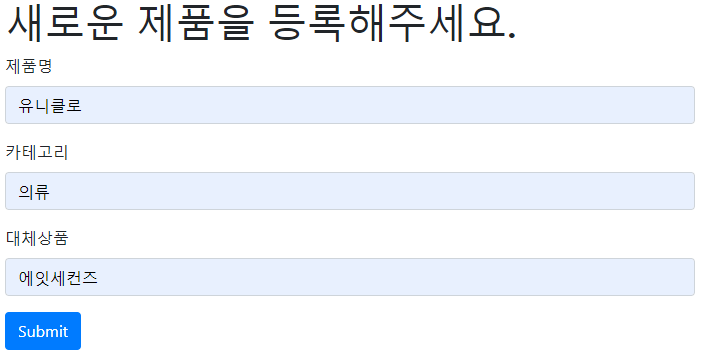
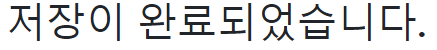
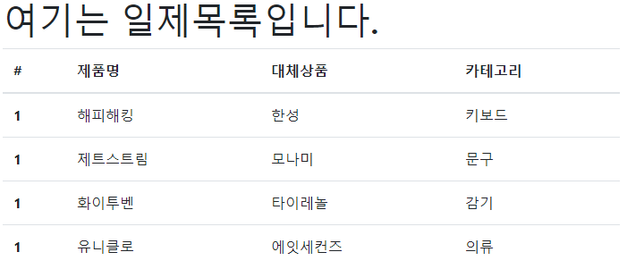
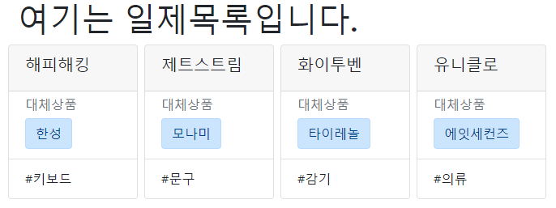

# Web Service 1주차 (2019.08.01)

## nono

'127.0.0.1:5000/new?product=해피해킹&category=키보드&replace=한성'

주소(127.0.0.1:5000)안의 경로(/new)의 key값들(?product=해피해킹&category=키보드&replace=한성)을 열어준다.


### app.py

> 서버에 경로를 만들어준다. 'base.html'을 추가해줘야 한다.

```python
import csv

# /nono 경로를 만든다.
@app.route('/nono')
def nono():
    with open('data.csv', 'r', encoding='utf-8') as f:
        reader = csv.reader(f)
        products = list(reader)
    return render_template('nono.html', products=products)

# /new 경로를 만든다.
@app.route('/new')
def new():
    return render_template('new.html')

# /create 경로를 만든다.
@app.route('/create')
def create():
    product = request.args.get('product')
    category = request.args.get('category')
    replace = request.args.get('replace')

    with open('data.csv', 'a+', encoding='utf-8', newline='') as f:
        writer = csv.writer(f)
        #['해피해킹', '키보드', '한성']
        product_info = [product, category, replace]
        writer.writerow(product_info)

    return render_template('create.html')
```


### new

> 새로운 제품을 등록해주는 경로와 html을 만들어준다.



```python
@app.route('/new')
def new():
    return render_template('new.html')
```

```html



  <h1>새로운 제품을 등록해주세요.</h1>
  <!-- form action: 데이터 전송 -->
  <form action="/create">
    <div class="form-group">
      <label for="product">제품명</label>
      <input type="text" class="form-control" id="product" name="product">
    </div>
    <div class="form-group">
      <label for="category">카테고리</label>
      <input type="text" class="form-control" id="category" name="category">
    </div>
    <div class="form-group">
      <label for="replace">대체상품</label>
      <input type="text" class="form-control" id="replace" name="replace">
    </div>
    <button type="submit" class="btn btn-primary">Submit</button>
  </form>

```

getbootstrap.com에서 Documentation - Components - Form을 참고한다.


### create

> 저장이 완료되었음을 알려주는 html을 만들어준다.



```python
@app.route('/create')
def create():
    # 딕셔너리에서 value값을 뽑아준다.
    product = request.args.get('product')
    category = request.args.get('category')
    replace = request.args.get('replace')

    with open('data.csv', 'a+', encoding='utf-8', newline='') as f:
        writer = csv.writer(f)
        #['해피해킹', '키보드', '한성']
        product_info = [product, category, replace]
        writer.writerow(product_info)

    return render_template('create.html')
```

```html



  <h1>저장이 완료되었습니다.</h1>

```


### nono

> nono페이지의 html을 만들어준다.



```python
def nono():
    with open('data.csv', 'r', encoding='utf-8') as f:
        reader = csv.reader(f)
        products = list(reader)
    return render_template('nono.html', products=products)
```

```html


  <h1>여기는 일제목록입니다.</h1>
  <!-- html에서 아래처럼 python을 사용할 수 있다. -->

  <table class="table">
    <thead>
      <tr>
        <th scope="col">#</th>
        <th scope="col">제품명</th>
        <th scope="col">대체상품</th>
        <th scope="col">카테고리</th>
      </tr>
    </thead>
    <tbody>
      
      <tr>
        <th scope="row">1</th>
        <td>{{product[0]}}</td>
        <td>{{product[2]}}</td>
        <td>{{product[1]}}</td>
      </tr>
      
    </tbody>
  </table>


```


#### for문

> html을 python처럼 실행시킬 수 있다.

```html

<tr>
    <th scope="row">1</th>
    <td>{{product[0]}}</td>
    <td>{{product[2]}}</td>
    <td>{{product[1]}}</td>
</tr>

```


#### 주석 쓰는 방법

> `<!-- {# (내용) #} -->`

```html
<!-- {# 
  {{product}}
 #} -->
```


### nonocard 직접 써보기



```python
@app.route('/nonocard')
def nonocard():
    with open('data.csv', 'r', encoding='utf-8') as f:
        reader = csv.reader(f)
        products = list(reader)
    return render_template('nonocard.html', products=products)
```

```html



  <h1>여기는 일제목록입니다.</h1>
  <div class="row">
    
    <div class="card mx-1" style="width: 10rem;">
      <div class="card-header">
        <h5>{{product[0]}}</h5>
      </div>
      <!-- <div class="card-body"> -->
      <ul class="list-group list-group-flush">
        <li class="list-group-item">
          <h6 class="card-subtitle mb-2 text-muted">대체상품</h6>
          <a href="#" class="btn btn-primary alert-primary">{{product[2]}}</a>
        </li>
        <li class="list-group-item">
          <p class="card-text">#{{product[1]}}</p>
        </li>
      </ul>
      <!-- </div> -->
    </div>
    
  </div>

```

