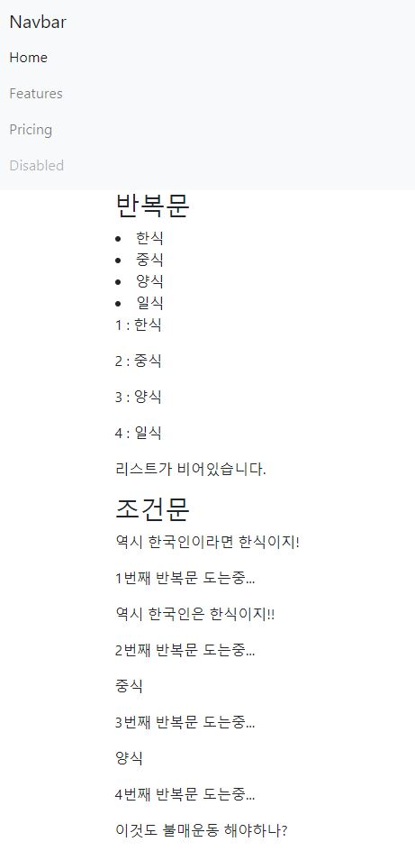
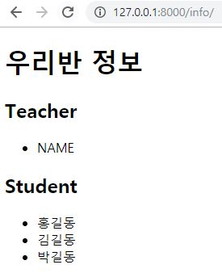
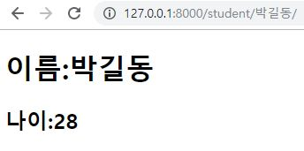

# Web Service 2주차 (2019.08.05)

## Django

Find your new favorite web framework: 'https://hotframeworks.com/'

Django를 사람들이 많이 사용함을 알 수 있다.


### 웹 서비스를 제작하는 방법

> 프레임워크를 사용하면 웹서비스를 좀더 쉽게 작성할 수 있다.


### MVC (Model View Controller)

> 디자인 패턴


### MTV (Model Template View)

> Django에서는 MVC를 MTV라고 부른다.

'https://docs.djangoproject.com/ko/2.2/faq/general/'


- Model: 데이터를 관리

- Template: 사용자가 보는 화면

- View: Model과 Template의 중간 관리자


서버에서 요청이 들어오면 View에서 처음 반응한다.

Model이 Database에서 찾고 View로 전달한다.

Template에서 사용자가 볼 수 있도록 변형하여 전달한다.


### in Flask

>  route는 어떤 url 요청이 들어올지 대기한다.


## Django 환경설정하기

```bash
mkdir django
cd django
mkdir 01_django_intro
cd 01_django_intro
python -m venv venv # venv: version environment # 가상 환경을 만들어준다.
ls
source venv/Scripts/activate # (venv)가 따라온다. # 현재 폴더에서는 (venv)환경을 쓸 예정임을 알려준다.
pip list # 새로운 환경의 pip을 확인할 수 있다.
code .
F1 > select interpreter > Python(venv) 선택
python -V # python version 확인

# 비활성화 방법
deactivate
pip list # 원래 환경의 pip list가 나온다.
```


## Django 설치하기

```bash
pip list # 아무것도 설치가 되어있지 않다.
pip install django
pip list # Django 2.2.4 version이 설치된 것을 확인할 수 있다.

# 앞으로 자주 쓰게 될 코드
django-admin startproject django_intro .
python manage.py runserver # 링크를 'ctrl + 클릭'하면 우주선 화면이 실행된다.
```


`__init__`.py: 패키지를 인식할 수 있도록 해준다.

settings.py: 설정을 바꿔주는 파일이다.

wsgi.py: 파이썬 서버 배포 전에는 사용 x


```bash
django-admin startapp pages # 앱을 만들어준다.
```


admin.py: 관리자 권한으로 실행해줄 때 사용한다.

model.py: 데이터베이스를 관리할 때 사용한다.

views.py: 중간에서 관리해준다.


### settings.py

```python
INSTALLED_APPS = [
    'pages',
    'django.contrib.admin',
    'django.contrib.auth',
    'django.contrib.contenttypes',
    'django.contrib.sessions',
    'django.contrib.messages',
    'django.contrib.staticfiles',
]

# LANGUAGE_CODE = 'en-us'
LANGUAGE_CODE = 'ko-kr'

# TIME_ZONE = 'UTC'
TIME_ZONE = 'Asia/Seoul'
```

settings.py의 INSTALLED_APPS 리스트에 'pages'를 추가해준다. 순서대로 실행되기 때문에, 자신이 만든 것을 앞에다 적어주는 것이 좋다.

LANGUAGE_CODE = 'ko-kr'로 바꾸어주면 자동으로 한글로 바꿔준다.


'apps.py', 'veiws.py', 'urls.py'를 가장 많이 바꾸게 될 예정이다.


### urls.py

> 경로에 함수를 지정해준다.

```python
from django.contrib import admin
from django.urls import path
# pages의 views 모듈을 불러온다.
from pages import views

urlpatterns = [
    path('admin/', admin.site.urls),
    path('index/', views.index),
    path('dinner/', views.dinner),
    path('image/', views.image),
    path('greeting/<str:name>/', views.greeting),
    path('cube/<int:num>/', views.cube),
    path('mul/<int:num1>/<int:num2>/', views.mul),
    path('dtl/', views.dtl),
    path('christmas/', views.christmas),
]
```

views 모듈에서 함수를 찾아온다.


### views.py

> 함수를 정의한다.

```python
def index(request):
    return render(request, 'index.html')

def dinner(request):
    menu = ['중식', '한식', '양식']
    pick = random.choice(menu)

    context = {
        'pick': pick,
        'menu': menu,
    }
    return render(request, 'dinner.html', context)

def image(request):
    pick = random.choice(range(10))
    context = {
        'img_url': f'https://picsum.photos/id/{pick}/200/300',
    }
    return render(request, 'image.html', context)

def greeting(request, name):
    context = {
        'name': name
    }
    return render(request, 'greeting.html', context)

def cube(request, num):
    cubic = num ** 3
    context = {
        'num': num,
        'cubic': cubic
    }
    return render(request, 'cube.html', context)

def mul(request, num1, num2):
    context = {
        'result': num1*num2,
        'num1': num1,
        'num2': num2,
    }
    return render(request, 'mul.html', context)

def dtl(request):
    menus = ['한식', '중식', '양식', '일식']
    sentence = 'Life is short you need python'
    messages = {
        'apple': '사과',
        'banana': '바나나',
        'peach': '복숭아',
    }
    now = datetime.datetime.now()
    empty = []

    context = {
        'now': now,
        'messages': messages,
        'sentence': sentence,
        'menus': menus,
        'empty': empty,
    }
    return render(request, 'dtl.html', context)

def christmas(request):
    now = datetime.datetime.now()
    month = now.month
    day = now.day
    
    today = f'{month}/{day}'

    if today == '12/25':
        is_christmas = True
    else:
        is_christmas = False
    
    context = {
        'is_christmas': is_christmas
    }
    return render(request, 'christmas.html', context)
```


### templates폴더의 html

> html파일을 templates 안에 작성해준다.


#### base.html

```html
<nav class="navbar navbar-expand-lg navbar-light bg-light">
    <a class="navbar-brand" href="#">Navbar</a>
    <button class="navbar-toggler" type="button" data-toggle="collapse" data-target="#navbarNavAltMarkup" aria-controls="navbarNavAltMarkup" aria-expanded="false" aria-label="Toggle navigation">
        <span class="navbar-toggler-icon"></span>
    </button>
    <div class="collapse navbar-collapse" id="navbarNavAltMarkup">
        <div class="navbar-nav">
            <a class="nav-item nav-link active" href="#">Home <span class="sr-only">(current)</span></a>
            <a class="nav-item nav-link" href="#">Features</a>
            <a class="nav-item nav-link" href="#">Pricing</a>
            <a class="nav-item nav-link disabled" href="#" tabindex="-1" aria-disabled="true">Disabled</a>
        </div>
    </div>
</nav>
<div class="container">
    
    
</div>
```


#### dtl.html



```html



  <h3>반복문</h3>
  
    <li>{{menu}}</li>
  

  
    <p>{{forloop.counter}} : {{menu}}</p>
  

  
    <p>{{e}}</p>
  
    <p>리스트가 비어있습니다.</p>
  

  <h3>조건문</h3>
  
    <p>역시 한국인이라면 한식이지!</p>
  

  
    <p>{{forloop.counter}}번째 반복문 도는중...</p>
    
      <p>역시 한국인은 한식이지!!</p>
    
      <p>이것도 불매운동 해야하나?</p>
    
      <p>{{menu}}</p>
    
  

```


#### christmas.html

> 'https://isitchristmas.com/' 참고

```html



  
    <h1>오늘은 크리스마스입니다.</h1>
  
    <h1>오늘은 크리스마스가 아닙니다.</h1>
  

```


## Workshop Django 환경만들기

```bash
cd homeworkshop/workshop
mkdir 13workshop
cd 13workshop
python -m venv venv
source venv/Script/activate
pip install django
django-admin startproject classroom .
python manage.py runserver
```


### urls.py

```python
from django.contrib import admin
from django.urls import path
from pages import views

urlpatterns = [
    path('admin/', admin.site.urls),
    path('info/', views.info),
    path('student/<str:name>/', views.student),
]
```


### views.py

```python
from django.shortcuts import render

def info(request):
    teacher = 'NAME'
    students = ['홍길동', '김길동', '박길동']
    context = {
        'teacher': teacher,
        'students': students,
    }
    return render(request, 'info.html', context)

def student(request, name):
    student_age = {
        '홍길동': 26,
        '김길동': 27,
        '박길동': 28,
    }
    
    for n, a in student_age.items():
        if n == name:
            age = a

    context = {
        'name': name,
        'age': age,
    }
    return render(request, 'student.html', context)
```


### templates

#### info.html



````html
<h1>우리반 정보</h1>
<h2>Teacher</h2>
<ul>
    <li>{{teacher}}</li>
</ul>
<h2>Student</h2>
<ul>
    
    <li>{{student}}</li>
    
</ul>
````


#### student.html



```html
<h1>이름:{{name}}</h1>
<h2>나이:{{age}}</h2>
```

