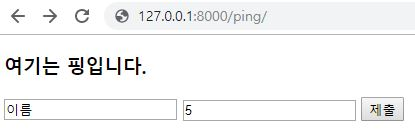
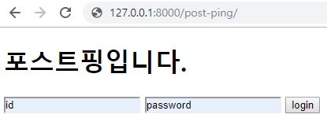
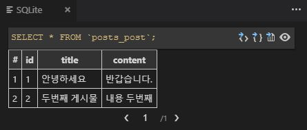
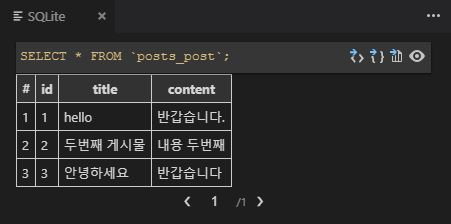
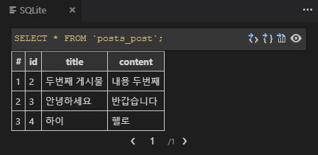
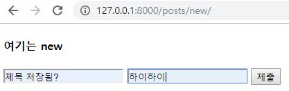
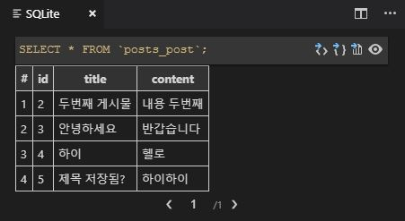

# Web Service 2주차 (2019.08.06)

## app을 만드는 명령어

```bash
# 앱을 만들어준다.
python manage.py startapp your_app_name
django-admin startapp your_app_name
```


## 02_django_advanced

```bash
$ cd django/
$ mkdir 02_django_advanced
$ cd 02_django_advanced/
$ python -m venv venv
$ source venv/Scripts/activate
$ pip install django
$ django-admin startproject django_ad .

# 폴더에서 open with code
# vs code 안에서
$ django-admin startapp pages
```


### urls.py

````python
from django.contrib import admin
from django.urls import path
from pages import views

urlpatterns = [
    path('admin/', admin.site.urls),
    path('ping/', views.ping),
    path('pong/', views.pong),
    path('post-ping/', views.post_ping),
    path('post-pong/', views.post_pong),
    path('static-example/', views.static_example),
]
````


## GET

> url 뒤에 데이터가 들어간다.

### views.py

```python
def ping(request):
    return render(request, 'ping.html')

def pong(request):
	# request.GET('name')
	# raise
    user_name = request.GET.get('name')
    user_age = request.GET.get('age')
    context = {
        'user_name': user_name,
        'user_age': user_age,
    }
    return render(request, 'pong.html', context)
```

raise는 강제로 'Runtime Error' 오류를 보여준다.


### ping.html



```html
:
    return render(request, 'post_ping.html')

def post_pong(request):
    username = request.POST.get('username')
    password = request.POST.get('password')
    context = {
        'username': username,
        'password': password,
    }
    return render(request, 'post_pong.html', context)
```


### post_ping



```html



  <h1>포스트핑입니다.</h1>
  <form action="/post-pong/" method="post">
    <!-- type="hidden" -->
    
    <input type="text" name="username">
    <input type="text" name="password">
    <input type="submit" value="login">
  </form>

```


### post_pong


```html



  <h1>여기는 포스트퐁</h1>

```


## static

> 새로고침을 해줘야 한다. `ctrl + shift + r : 강력 새로고침`


### views.py

```python
def static_example(request):
    return render(request, 'static_example.html')
```


### static_example.html

```html




  <link rel="stylesheet" href="">
  <h1>고래</h1>
  <!-- static 폴더의 image 폴더 안에 있는 test.jpg 파일 -->
  

```


### style.css

> static 폴더 안에 존재한다.

```css
h1 {
  color: red;
}
```


## utilities 앱 생성

```bash
$ django-admin startapp utilities
```


### settings.py

> INSTALLED_APPS에 'utilities'를 추가해준다.

```python
INSTALLED_APPS = [
    'pages',
    'utilities',
    'django.contrib.admin',
    'django.contrib.auth',
    'django.contrib.contenttypes',
    'django.contrib.sessions',
    'django.contrib.messages',
    'django.contrib.staticfiles',
]
```


### urls.py (django_ad)

```python
from django.contrib import admin
from django.urls import path, include
from pages import views

urlpatterns = [
    path('admin/', admin.site.urls),
    # 127.0.0.1:8000/pages/ping/
    path('pages/', include('pages.urls')),
    path('utilities/', include('utilities.urls')),
]
```

`pages/` 경로에서 `pages.urls`경로를 찾는다.

`utilities/` 경로에서 `utilities.urls`경로를 찾는다.


### urls.py (pages)

```python
from django.urls import path
from . import views

urlpatterns = [
    path('ping/', views.ping),
    path('pong/', views.pong),
    path('post-ping/', views.post_ping),
    path('post-pong/', views.post_pong),
    path('static-example/', views.static_example),
]
```


## models

data를 가지고 할 수 있는 것은 'crud'이다.

'creat, read, update, delete'


### orm (object-relational-mapping)

파이썬 코드를 번역해주는 역할을 한다.

```
python manage.py makemigrations
```

번역작업을 한다.


```
python manage.py migrate
```

파이썬 코드를 sql에서 이해할 수 있도록 바꾸었다.


### shell 작성

```python
python manage.py shell

>>> from posts.models import Post
>>> Post # <class 'posts.models.Post'>
>>> p = Post # <Post: Post object (None)>
>>> p.title # ''
>>> p.title = '안녕하세요'
>>> p.content = '반갑습니다'
>>> p.title # '안녕하세요'
>>> p.content # '반갑습니다'
>>> p # <Post: Post object (None)>
>>> p.save()
>>> p # <Post: Post object (1)>

>>> p2 = Post()
>>> p2 # <Post: Post object (None)>
>>> p2.title = '두번째 게시물'
>>> p2.content = '내용 두번째'
>>> p2 # <Post: Post object (None)>
>>> p2.save()
>>> p2 # <Post: Post object (1)>

>>> Post.objects.all() # <QuerySet [<Post: Post object (1), <Post: Post object (2)>]>
>>> Post.objects.all()[1] # <Post: Post object (2)>

>>> exit() # 나가기
```


확장프로그램 중 SQLite를 설치한다.

F1 - sqlite - open database - sqlite 선택한다.

SQLITE posts_post 오른쪽 화살표를 누르면 table이 나온다.


### Post 저장

```
pip install django_extensions
```


#### settings.py

```python
INSTALLED_APPS = [
    'pages',
    'posts',
    'django_extensions', # 추가
    'django.contrib.admin',
    'django.contrib.auth',
    'django.contrib.contenttypes',
    'django.contrib.sessions',
    'django.contrib.messages',
    'django.contrib.staticfiles',
]

```


#### models.py

```python
from django.db import models

# Create your models here.
class Post(models.Model):
    title = models.CharField(max_length=100)
    content = models.CharField(max_length=100)
```


#### shell 실행



```python
python manage.py shell_plus

>>> Post # <class 'posts.models.Post'>
>>> Post.objects.all() # <QuerySet [<Post: Post object (1), <Post: Post object (2)>]>
>>> Post.objects.get(id=1) # <Post: Post object (1)>
>>> Post.objects.get(id=3) # posts.models.Post.DoesNotExist
>>> Post.objects.get(title='안녕하세요') # <Post: Post object (1)>
>>> p = Post.objects.get(id=1)
>>> p # <Post: Post object (1)>
>>> Post.objects.create(title='안녕하세요', content='반갑습니다') # <Post: Post object (3)>
>>> Post.objects.filter(title='안녕하세요') # <QuerySet [<Post: Post object (1), <Post: Post object (3)>]>
>>> p.title # '안녕하세요'
>>> p.content # '반갑습니다.'
```



```python
>>> p.title = 'hello'
>>> p.title # 'hello'
>>> p.save()
```



```python
>>> p.delete() # (1, {'posts.Post': 1})
>>> post1 = Post(title='하이' content='헬로')
>>> post1.title # '하이'
>>> post1.save()
```


#### urls.py (django_ad)

```python
urlpatterns = [
    path('admin/', admin.site.urls),
    # 127.0.0.1:8000/pages/ping/
    path('pages/', include('pages.urls')),
    path('posts/', include('posts.urls')),
]
```


#### urls.py (posts)

```python
from django.urls import path
from . import views

urlpatterns = [
    path('', views.index), # ~/posts/
    path('new/', views.new),
    path('create/', views.create),
]
```


#### new.html



````html



  <h4>여기는 new</h4>
  <form action="/posts/create/">
    <input type="text" name="title">
    <input type="text" name="content">
    <input type="submit">
  </form>

````


#### create.html




#### create.html

```html



  <h1>게시물이 작성되었습니다.</h1>

```


#### index.html


```html



  <h1>여기는 게시물 목록</h1>
  
    <p>{{post.title}} : {{post.content}}</p>
  

```

