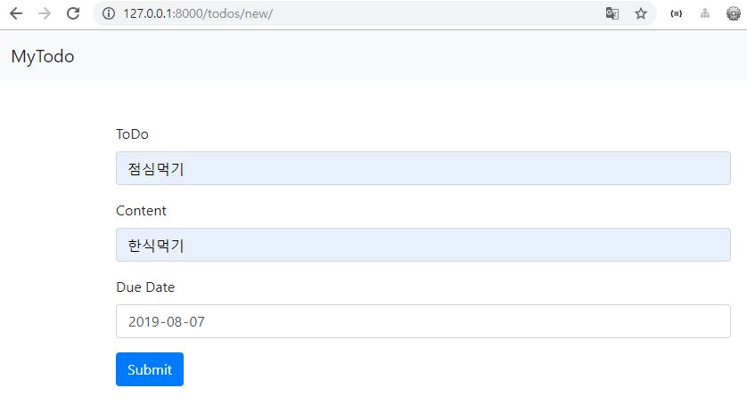
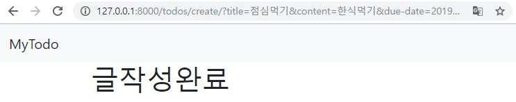
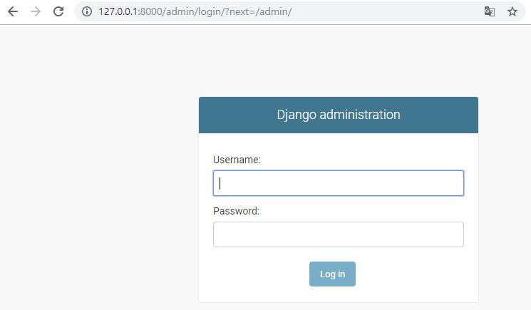
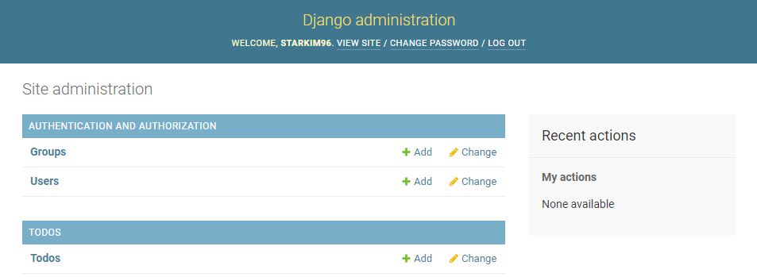
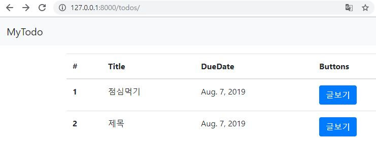
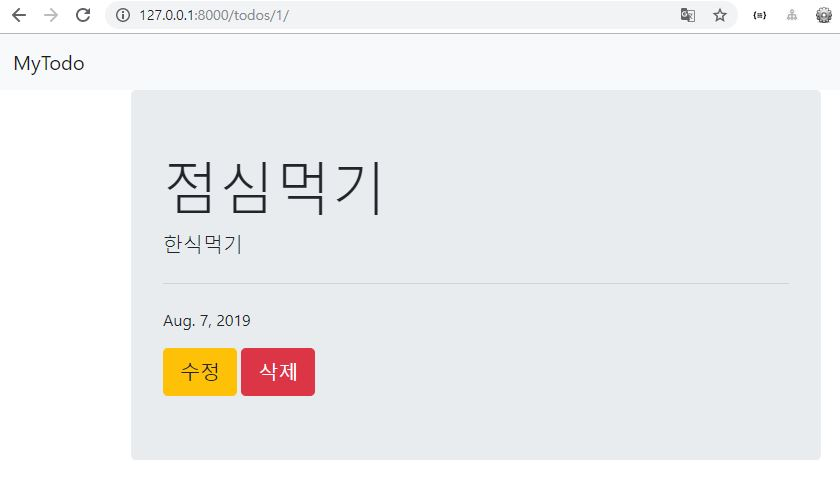

# Web Service 2주차 (2019.08.07)

## 03_board

```bash
# vs code 안에서 실행
$ python -m venv venv # 터미널 재실행
$ pip install django
$ django-admin startproject board .
$ django-admin startapp todos
```


### commit 남기기

```bash
$ git init
$ git add .
$ git commit -m "내용"
$ git log # commit 확인
q # log 실행시 강제종료
```


### settings.py

```python
INSTALLED_APPS = [
    'todos',
    'django.contrib.admin',
    'django.contrib.auth',
    'django.contrib.contenttypes',
    'django.contrib.sessions',
    'django.contrib.messages',
    'django.contrib.staticfiles',
]
```


### urls.py (board)

```python
from django.contrib import admin
from django.urls import path, include

urlpatterns = [
    path('admin/', admin.site.urls),
    path('todos/', include('todos.urls')),
]
```


## New (Create)

### urls.py (todos)

```python
from django.urls import path
from . import views

urlpatterns = [
    # Create
    path('new/', views.new), # form을 보여준다.
]
```


### views.py

```python
from django.shortcuts import render

# Create your views here.
def new(request):
    return render(request, 'new.html')
```


### base.html

```html
<!DOCTYPE html>
<!-- 이 페이지가 어떤 언어를 기본 언어로 가지고 있는지 보여준다. -->
<html lang="en">
<head>
  <!-- charset은 문자열을 setting해준다. -->
  <meta charset="UTF-8">
  <!-- width를 장치의 width로 하며, viewport를 기준으로 한다. -->
  <meta name="viewport" content="width=device-width, initial-scale=1.0">
  <meta http-equiv="X-UA-Compatible" content="ie=edge">
  <title>Document</title>
  <!-- CSS 복사 -->
</head>
<body>
  <nav class="navbar navbar-expand-lg navbar-light bg-light">
    <a class="navbar-brand" href="#">MyTodo</a>
    <button class="navbar-toggler" type="button" data-toggle="collapse" data-target="#navbarNavAltMarkup" aria-controls="navbarNavAltMarkup" aria-expanded="false" aria-label="Toggle navigation">
      <span class="navbar-toggler-icon"></span>
    </button>
    <div class="collapse navbar-collapse" id="navbarNavAltMarkup">
      <div class="navbar-nav">
        <a class="nav-item nav-link active" href="/todos/">All <span class="sr-only">(current)</span></a>
        <!-- base.html에서 herf는 항상 경로 접근을 한다. -->
        <a class="nav-item nav-link" href="/todos/new/">New</a>
      </div>
    </div>
  </nav>
  <!-- block을 container에 담아준다. -->
  <div class="container">
    
    
  </div>
  
  <!-- JS 복사 -->
</body>
</html>
```


### new.html



```html


<form action="/todos/create/" class="mt-5">
  <div class="form-group">
    <label for="title">ToDo</label>
    <input type="text" class="form-control" id="title" name="title">
  </div>
  <div class="form-group">
    <label for="content">Content</label>
    <input type="text" class="form-control" id="content" name="content">
  </div>
  <div class="form-group">
    <label for="due-date">Due Date</label>
    <input type="date" class="form-control" id="due-date" name="due-date">
  </div>
  <button type="submit" class="btn btn-primary">Submit</button>
</form>

```


## create (Create)

### urls.py (todos)

```python
urlpatterns = [
    # Create
    path('new/', views.new), # form을 보여준다.
    path('create/', views.create),
]
```


### views.py

```python
def create(request):
    # GET 요청을 받아서 new.html의 name="title"의 정보를 title에 저장해준다.
    title = request.GET.get('title')
    content = request.GET.get('content')
    due_date = request.GET.get('due-date')
    # print(title, content, due_date)

    # 1번
    # models.py에 저장되어있는 class Todo의 정보를 인스턴스 todo에 저장한다.
    todo = Todo()
    todo.title = title
    todo.content = content
    todo.due_date = due_date
    # 데이터를 넣고 저장을 하지 않았기에 save()를 해줘야 데이터베이스에 반영된다.
    todo.save()
	
    # 2번
    todo = Todo(title=title, content=content, due_date=due_date)
    todo.save()

    return render(request, 'create.html')
```


### create.html



```html


  <h1>글작성완료</h1>

```


### models.py

> 데이터를 저장하는 구조를 만든다.

```python
from django.db import models

# Create your models here.
# 데이터를 저장하는 구조 만들기
class Todo(models.Model):
    # 제목
    title = models.CharField(max_length=50)
    # 상세내용
    content = models.CharField(max_length=200)
    # 마감일
    due_date = models.DateField()
```


## SQL 생성

> create, read, update, delete가 작동할 수 있도록 한다.

```bash
python manage.py makemigrations # python코드를 sql이 읽을 수 있도록 번역해준다.
python manage.py migrate # python에서 sql로 이주하면서 구조를 만들고 저장해준다.
```


## admin

> 관리자 페이지로 앞으로 실행하는 페이지와 동시에 켜두고 진행한다.



```bash
$ python manage.py createsuperuser
```


### admin.py (todos)

> 관리자 페이지에 TODOS를 생성해준다.



```python
from django.contrib import admin
from .models import Todo

# Register your models here.
admin.site.register(Todo)
```


## index (Read)

### urls.py (todos)

```python
from django.urls import path
from . import views

urlpatterns = [
    # Create
    path('new/', views.new), # form을 보여준다.
    path('create/', views.create),
    # Read
    # 경로가 지정되있지 않으면 연결해준다.
    path('', views.index),
]
```


### views.py

```python
def index(request):
    # models.py에 저장되어있는 class Todo의 인스턴스 todo에서 모든 정보를 가져온다.
    todos = Todo.objects.all()
    context = {
        'todos': todos,
    }
    return render(request, 'index.html', context)
```


### index.html



```html



<table class="table mt-3">
  <thead>
    <tr>
      <th scope="col">#</th>
      <th scope="col">Title</th>
      <th scope="col">DueDate</th>
      <th scope="col">Buttons</th>
    </tr>
  </thead>
  <tbody>
    
      <tr>
        <!-- id는 자동생성 -->
        <th scope="row">{{todo.id}}</th>
        <td>{{todo.title}}</td>
        <td>{{todo.due_date}}</td>
        <td>
          <a href="/todos/{{todo.id}}/" class="btn btn-primary">글보기</a>
        </td>
      </tr>
    
  </tbody>
</table>

```

`tr>td+td*3 + tab`을 하면 자동으로 태그가 생성된다.


## detail (Read)

### urls.py (todos)

```python
from django.urls import path
from . import views

urlpatterns = [
    # Create
    path('new/', views.new), # form을 보여준다.
    path('create/', views.create),
    # Read
    # 경로가 지정되있지 않으면 연결해준다.
    path('', views.index),
    # 지정된 위치에 들어오는 숫자를 todo_id라고 한다.
    path('<int:todo_id>/', views.detail),
]
```


### views.py

```python
def detail(request, todo_id):
    # models.py에 저장되어있는 class Todo의 인스턴스 todo에서 id 정보를 가져온다.
    todo = Todo.objects.get(id=todo_id)
    context = {
        'todo': todo,
    }
    return render(request, 'detail.html', context)
```


### detail.html



```html



  <!-- <h1>여기는 디테일 입니다.</h1>
  {{todo}} -->
  <div class="jumbotron">
    <h1 class="display-4">{{todo.title}}</h1>
    <p class="lead">{{todo.content}}</p>
    <hr class="my-4">
    <p>{{todo.due_date}}</p>
    <!-- 수정을 위한 href를 연결해준다. -->
    <a class="btn btn-warning btn-lg" href="/todos/{{todo.id}}/edit/" role="button">수정</a>
    <!-- 삭제를 위한 href를 연결해준다. -->
    <a class="btn btn-danger btn-lg" href="/todos/{{todo.id}}/delete/" role="button">삭제</a>
  </div>

```


## delete (Delete)

### urls.py (todos)

```python
urlpatterns = [
    # Create
    path('new/', views.new), # form을 보여준다.
    path('create/', views.create),
    # Read
    # 경로가 지정되있지 않으면 연결해준다.
    path('', views.index),
    # 지정된 위치에 들어오는 숫자를 todo_id라고 한다.
    path('<int:todo_id>/', views.detail),
    # Delete
    path('<int:todo_id>/delete/', views.delete),
]
```


### views.py

```python
def delete(request, todo_id):
    todo = Todo.objects.get(id=todo_id)
    todo.delete()
    return render(request, 'delete.html')
```


### delete.html

```html


  <h1>글이 삭제되었습니다.</h1>

```


### index.html

> ``를 추가한다.

```html
<tbody>
  
    <tr>
      <!-- id는 자동생성 -->
      <th scope="row">{{todo.id}}</th>
      <td>{{todo.title}}</td>
      <td>{{todo.due_date}}</td>
      <td>
        <a href="/todos/{{todo.id}}/" class="btn btn-primary">글보기</a>
      </td>
    </tr>
  <!-- for문을 돌리다가 비어있으면 실행 -->
  
    <tr>
      <td>#</td>
      <td>할일이 비었습니다.</td>
      <td>-</td>
      <td>-</td>
    </tr>
  
</tbody>
```


## edit (Update)

### urls.py (todos)

```python
from django.urls import path
from . import views

urlpatterns = [
    # Create
    path('new/', views.new), # form을 보여준다.
    path('create/', views.create),
    # Read
    # 경로가 지정되있지 않으면 연결해준다.
    path('', views.index),
    # 지정된 위치에 들어오는 숫자를 todo_id라고 한다.
    path('<int:todo_id>/', views.detail),
    # Update
    path('<int:todo_id>/edit/', views.edit),
    # Delete
    path('<int:todo_id>/delete/', views.delete),
]
```


### views.py

```python
def edit(request, todo_id):
    todo = Todo.objects.get(id=todo_id)
    context = {
        'todo': todo,
    }
    return render(request, 'edit.html', context)
```


### edit.html

```html


  <form action="/todos/{{todo.id}}/update/" class="mt-5">
    <div class="form-group">
      <label for="title">ToDo</label>
      <input type="text" class="form-control" id="title" name="title" value="{{todo.title}}">
    </div>
    <div class="form-group">
      <label for="content">Content</label>
      <input type="text" class="form-control" id="content" name="content" value="{{todo.content}}">
    </div>
    <div class="form-group">
      <label for="due-date">Due Date</label>
      <!-- 데이터의 형식을 '|'의 오른쪽 구성처럼 바꿔준다. -->
      <input type="date" class="form-control" id="due-date" name="due-date" value="{{todo.due_date|date:'Y-m-d'}}">
    </div>
    <button type="submit" class="btn btn-warning">수정</button>
  </form>

```

input의 빈 공간 안에 placeholder과 value값을 넣어줄 수 있다.

placeholder은 추가적인 설명, 예시, 언급을 해주며 데이터를 넣는 순간 사라진다. 이는 실제 값이 아니다.

value는 기본 값으로, 값을 미리 채워놓기 때문에 수정이 바로 가능하도록 한다.


## update (Update)

### urls.py (todos)

```python
from django.urls import path
from . import views

urlpatterns = [
    # Create
    path('new/', views.new), # form을 보여준다.
    path('create/', views.create),
    # Read
    # 경로가 지정되있지 않으면 연결해준다.
    path('', views.index),
    # 지정된 위치에 들어오는 숫자를 todo_id라고 한다.
    path('<int:todo_id>/', views.detail),
    # Update
    path('<int:todo_id>/edit/', views.edit),
    path('<int:todo_id>/update/', views.update),
    # Delete
    path('<int:todo_id>/delete/', views.delete),
]
```


### views.py

```python
def update(request, todo_id):
    title = request.GET.get('title')
    content = request.GET.get('content')
    due_date = request.GET.get('due-date')

    todo = Todo.objects.get(id=todo_id)
    todo.title = title
    todo.content = content
    todo.due_date = due_date
    # models.Model에 .save()등 많은 함수들이 저장되어 있다.
    todo.save()

    return render(request, 'update.html')
```


### update.html

```html


  <h1>글이 수정됨</h1>

```


## 경로 재설정

### view.py

```python
def create(request):
    title = request.GET.get('title')
    content = request.GET.get('content')
    due_date = request.GET.get('due-date')

    todo = Todo()
    todo.title = title
    todo.content = content
    todo.due_date = due_date
    todo.save()

    # render를 쓰는것도 가능하지만 코드의 흐름이 달라진다.
    return redirect('/todos/')

def delete(request, todo_id):
    todo = Todo.objects.get(id=todo_id)
    todo.delete()
    return redirect('/todos/')

def update(request, todo_id):
    title = request.GET.get('title')
    content = request.GET.get('content')
    due_date = request.GET.get('due-date')

    todo = Todo.objects.get(id=todo_id)
    todo.title = title
    todo.content = content
    todo.due_date = due_date
    todo.save()

    return redirect(f'/todos/{todo_id}/')
    # 아래처럼 todo.id도 가능
    # return redirect(f'/todos/{todo.id}/detail')
```


## 팝업창 띄우기

### detail.html

> `onclick="return confirm('내용')"`은 팝업창을 띄워준다.

```html


  <!-- <h1>여기는 디테일 입니다.</h1>
  {{todo}} -->
  <div class="jumbotron">
    <h1 class="display-4">{{todo.title}}</h1>
    <p class="lead">{{todo.content}}</p>
    <hr class="my-4">
    <p>{{todo.due_date}}</p>
    <a class="btn btn-warning btn-lg" href="/todos/{{todo.id}}/edit/" role="button">수정</a>
    <a class="btn btn-danger btn-lg" href="/todos/{{todo.id}}/delete/" role="button" onclick="return confirm('삭제할꺼니?')">삭제</a>
  </div>

```


## 날짜 정렬

### view.py

```python
def index(request):
    # models.py에 저장되어있는 class Todo의 인스턴스 todo에서 모든 정보를 가져온다.
    # 빠른 날짜 순서대로 정렬
    todos = Todo.objects.order_by('due_date').all()
    # 빠른 날짜 반대 순서로 정렬
    todos = Todo.objects.order_by('due_date').all()
    context = {
        'todos': todos,
    }
    return render(request, 'index.html', context)
```

